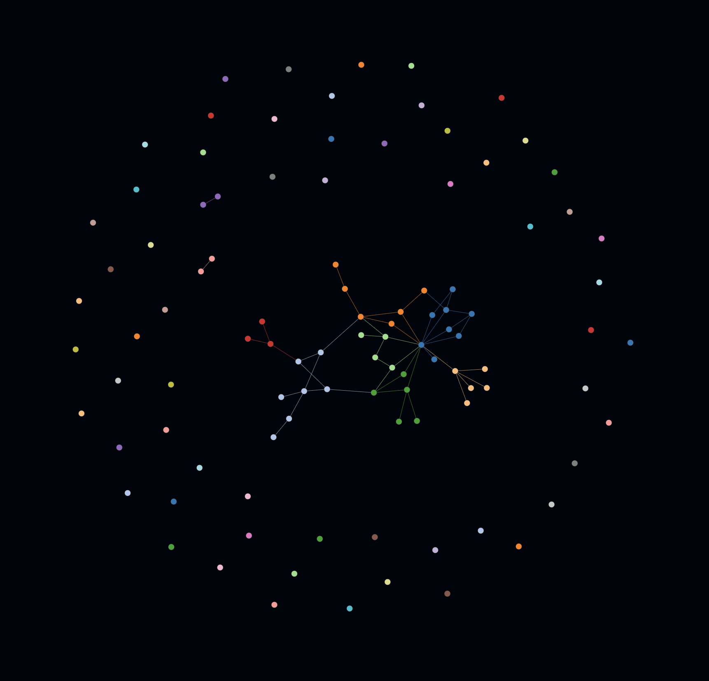

# Go Playground: Architectures, Design Patterns & Language Features

A hands-on repository demonstrating software architectures, design patterns, and Go language features through practical examples.

## Repository Structure

### Design Patterns

#### Creational Patterns
- **Singleton** - Single database instance pattern
- **Prototype** - Object cloning with three implementations:
  - Shapes (circle, rectangle)
  - File system (files and folders)
  - Characters
- **Abstract Factory** - Sports factory (Nike/Adidas products)

#### Structural Patterns
- **Decorator** - Data source with compression and encryption layers

#### Behavioral Patterns
- **Command** - Remote control pattern
- **Observer** - Football match notification system
- **State** - Vending machine state management
- **Strategy** - Cache eviction algorithms (FIFO, LRU, LFU)

#### Mixed Pattern Examples
- **Drone Fleet** - Registry pattern with command for different drone types
- **Home Control System** - State pattern for smart home modes

### Architectures

#### Event-Driven Architecture (EDA)
- **Cheesy Events** - Order processing system with event bus
  - Order management
  - Kitchen processing
  - Delivery tracking
  - Event-driven communication between services

### Language Features

#### Concurrency
- **Buffered Channels** - Locker room simulation
- **Worker Pool** - HTTP server with worker pool pattern

## Code Visualization

This project uses [emerge](https://github.com/glato/emerge) to visualize code structure and analyze dependencies.

### Generate Visualization

```shell
./viz.sh
```

Or directly:
```shell
emerge -c config.yml
```

### Dependency Graph



**[View Interactive Visualization](https://htmlpreview.github.io/?https://github.com/davidbaena/playground-go/blob/main/go-viz/html/emerge.html)**

The graph visualizes the codebase structure and module dependencies. The interactive version allows you to explore nodes, filter by metrics, and analyze the relationships between different components.
